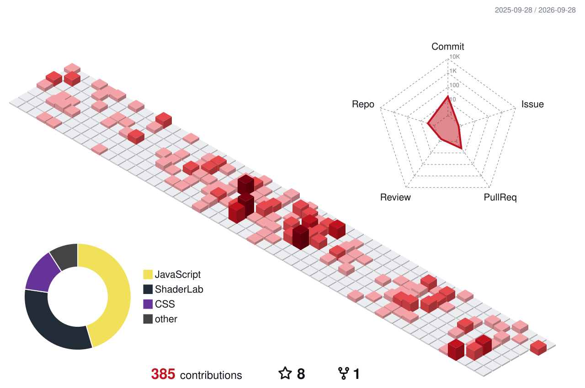
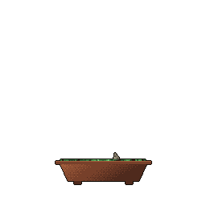

  <a href="https://bit.ly/jey-homepage">
    <picture>
      <source media="(prefers-color-scheme: dark)" srcset="https://readme-typing-svg.demolab.com/?font=Press+Start+2P&size=18&pause=1000&color=FFFFFF&center=true&vCenter=true&width=700&lines=Unity+Lead+%40+ITIC;Founder+%40+StranGen;Building+Hero+Arena;Teaching+Unity+at+NUU" />
      
    </picture>
  </a>

  
  
  

## Hey, I'm Jey 👋

I lead Unity development at IT Investments Center in Tashkent, where I mentor our junior and middle developers, and I teach Unity at New Uzbekistan University. Getting someone from zero to their first working game is something I like more than I expected to.

My main project is [Hero Arena](https://bit.ly/Hero_Arena_HomePage), a midcore game at my own studio, [StranGen](https://bit.ly/strangenLinktree).

I'm also a full-time web developer, working with TypeScript, React, Next.js and Node on AWS and Azure, and I do consulting.

### 🛠️ Stack

  

### 📺 Latest YouTube Videos

<!-- YOUTUBE:START -->
- [Trailer &quot;Hero Arena&quot;_v2](https://www.youtube.com/watch?v=opPOf6fqGoc)
- [Trailer &quot;Hero Arena&quot;](https://www.youtube.com/watch?v=6P_fh79wiJc)
- [Pitch for President Tech Award](https://www.youtube.com/watch?v=jtizXjSsGoQ)
- [Quick Game Development Update - New AI System and Gameplay Improvements](https://www.youtube.com/watch?v=ccOZmzhJ2gU)
- [First Hero of the game - PostProcessing effects Devlog #3](https://www.youtube.com/watch?v=_P3AizfbPuc)
<!-- YOUTUBE:END -->

### 🐍 Activity

<picture>
  <source media="(prefers-color-scheme: dark)" srcset="dist/snake-dark.svg" />
  
</picture>

<picture>
  <source media="(prefers-color-scheme: dark)" srcset="https://streak-stats.demolab.com/?user=Green-Blood&theme=dark&hide_border=true&background=0D1117&ring=C1121F&fire=FF3344&currStreakLabel=FF3344" />
  
</picture>

   
  🌳 grown with <a href="https://github.com/egorthinks/git-bonsai">git-bonsai</a>

### Connect with me

